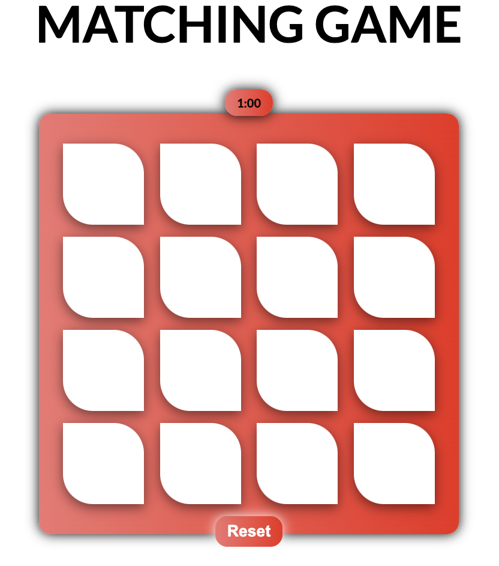

# Matching Game

This is a simple web-based memory-matching game implemented in HTML, CSS, and JavaScript.

## Table of Contents

- [Description](#description)
- [Game Features](#game-features)
- [How to Play](#how-to-play)
- [Screenshots](#screenshots)
- [Installation](#installation)


## Description

Matching Game is a classic memory game where the player is presented with a grid of cards, each containing an image. The goal is to find pairs of matching cards by flipping them over two at a time. The game is won when all pairs have been successfully matched.

## Game Features

- 8 pairs of cards for a total of 16 cards.
- A countdown timer to add a challenge.
- A "You won!" message when all pairs are matched.
- A "Play Again" button to reset the game.
- A "Reset" button to restart the game at any time.

## How to Play

1. Click on a card to reveal its image.
2. Click on another card to see if it matches the first card.
3. If the two cards match, they will remain face up.
4. If the two cards do not match, they will be flipped face down again.
5. Continue until all card pairs are matched.
6. If the timer runs out before all pairs are matched, you lose the game.

## Screenshots



## Installation

1. Clone the repository to your local machine:

   ```bash
   git clone https://github.com/Qassab/Matching-Game.git
